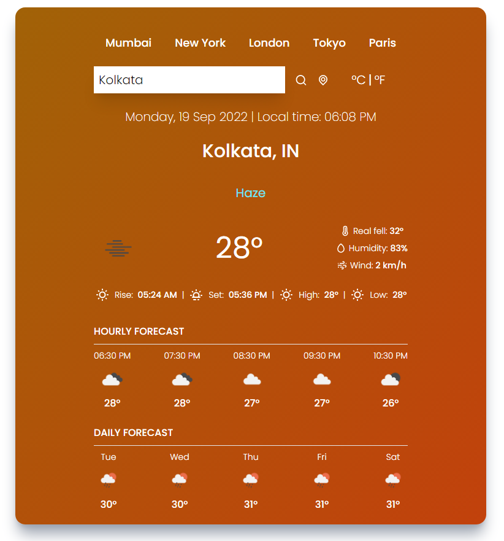
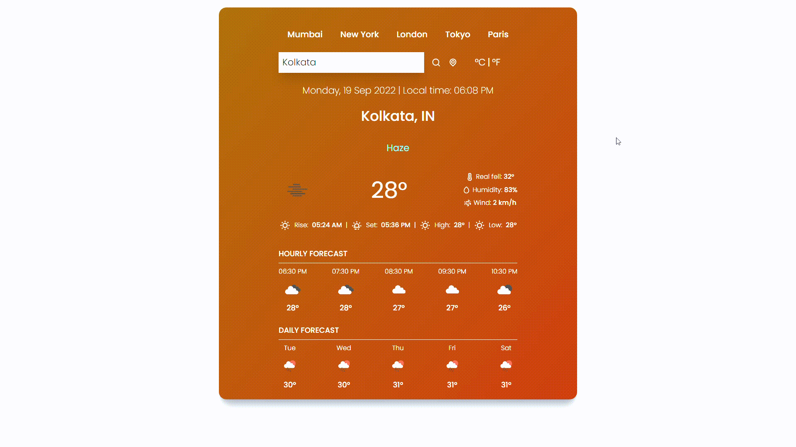

# Weatherz-REACT 🌥️

This is a weather forcasting application made using **ReactJS**. This is fully real time, all the weather datas are being fetch according to the given location.

#### ⚙️ Tech Stack used in this build

- ReactJS Framwork
- Tailwind-CSS
- **API :** openweatherapi

### User-Interface of the application

## 🎨 DEMO

### Steps to Install the application

- Copy the repository link
- pull the project `git clone`
- then install the dependencies `npm i`
- Run the project using `npm start`

Thank you for visiting my profile 😀
